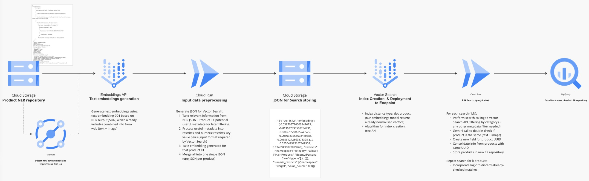

# entity-resolution

The code samples shared include two Jupyter Notebooks:

1. `Vector Search basic implementation.ipynb` - Shows how to use the VertexAI SDKs to create and query a Vector Store:
1.1. Use the text-embedding model to generate embeddings for retail products represented by a JSON.
1.2. Create and deploy a Vector Store Index (formerly called matching engine)
1.3. Query such an index to find the closer N embeddings or products given a particular input product (1:N search).

2. `Entity Resolution.ipynb` - Shows how to perform advance Entity Resolution using filtering:
2.1. Create an deploy a ready-to-filter index based on metadata (e.g. product category)
2.2. Perform queries using filters
2.3. Call Gemini to check which from top N neighbours are actually the same product
